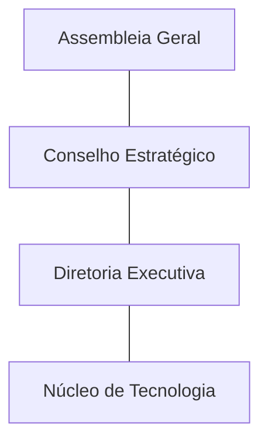
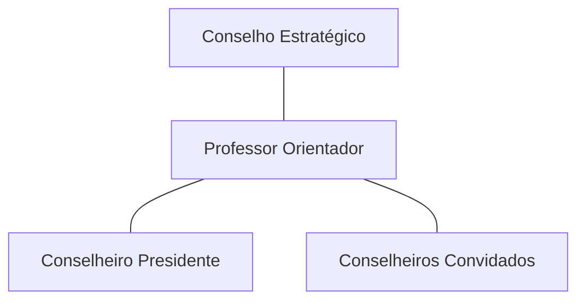
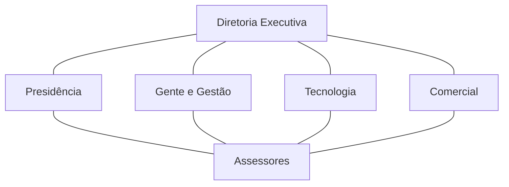
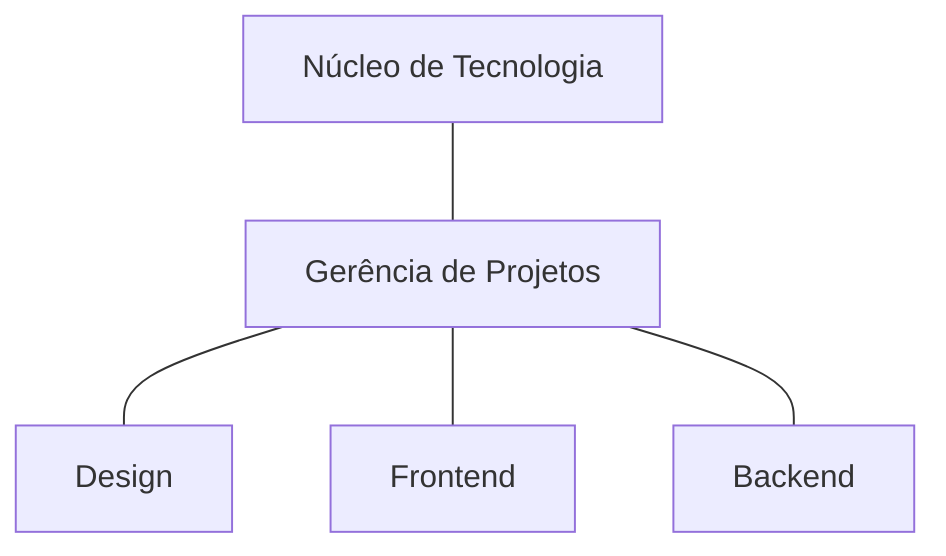
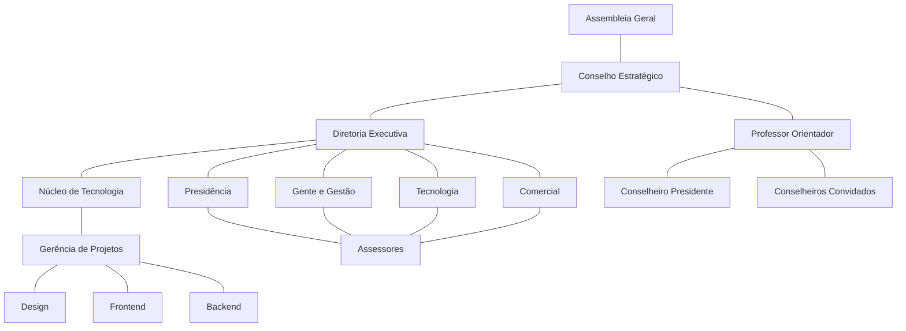

# Estrutura Empresarial

## Organograma Inicial {#initial-chart}

## Assembleia Geral {#general-meeting}

Órgão de deliberação soberana, podendo ser ordinária ou extraordinária, composta por todos os membros da **SofTeam**.

## Conselho Estratégico {#strategic-council}

Órgão de consulta, assesoramento e fiscalização à **Diretoria Executiva**, composta por:
  - Presidente do **Conselho Estratégico**;
  - Professor orientador da **Empresa Júnior**;
  - Membros convidados pelo Presidente do **Conselho Estratégico**.

### Professor Orientador {#professor}

Figura representativa da universidade, no qual atua como orientador da empresa júnior:
  - supervisiona e orienta as atividades da empresa;
  - auxilia nos esforços da empresa para que suas atividades sejam realizadas com excelência;
  - pode auxiliar e acompanhar projetos desenvolvidos pela empresa;
  - pode contribuir com formas de atualizar e/ou melhorar as técnicas, ferramentas e tecnologias utilizadas.

## Diretoria Executiva {#executive-board}

Responsável pela administração e representação da **SofTeam**, de forma a assegurar a consecução de seus objetivos.
São três **Diretorias** com **Assessores** previstas no **Estatuto**:
  - **Presidência**;
  - **Gente e Gestão**;
  - **Tecnologia**;
  - **Comercial**.

No caso de vacância da **Presidência** as outras diretorias atuam como representantes por **Estatuto**, respectivamente.

### Presidência {#presidency}

- responde e representa juridicamente pelos atos da **SofTeam** e representa perante os membros, sociedade, parceiros e
  comunidade acadêmica coordena as atividades da **Diretoria Executiva**;
- consolida parcerias institucionais;
- mantêm a sinergia entre a equipe e conduz as ações da **SofTeam**, de acordo com metas definidas no planejamento
  estratégico e prima por seu cumprimento.

### Gente e Gestão {#people-and-management}

- responsabiliza-se pelas atividades de suporte e infraestrutura;
- zela pelo bom funcionamento da sede organizando arquivos, elaborando atas e relatórios anuais de atividades;
- zela pelo aperfeiçoamento dos instrumentos de gestão, incorporando alterações quando necessário;
- elaborar documentos jurídicos;
- coordena o processo de admissão e exclusão de membros, atividades internas e atividades referentes às contas bancárias
  e pagamentos que dizem respeito aos deveres de pessoa jurídica;
- desenvolve diagnósticos para o treinamento dos membros selecionados;
- providenciar recursos necessários para efetivação do treinamento;
- participa da elaboração e aprovação dos projetos desenvolvidos;
- elaborar relatórios semestrais das atividades desenvolvidas.

### Tecnologia {#tec}

- elabora contato com o cliente e determina tecnologias a serem utilizadas;
- agrupa equipes e gerencia repositórios para realização de projetos;
- determina tecnologias a serem utilizadas e diretrizes a serem seguidas no **Núcleo de Tecnologia**.

### Comercial {#commercial}

- elabora plano de ações e estratégias referentes ao cargo;
- promove ações de marketing voltadas para a capacitação de clientes e parceiros;
- solidificar a imagem da empresa;
- promove a comunicação externa, seja com agentes internos ou a própria universidade;
- prospecta clientes e receber demandas;
- elabora orçamentos, acompanhamentos do cliente e controle do andamento da demanda dentro da empresa.

### Assessor {#assessor}

Compete a execução das atividades pertinentes a diretoria ao qual está ligado.

## Núcleo de Tecnologia {#tec-core}

Parte empresarial direcionada para o desenvolvimento e implementação das soluções propostas pelos clientes, logo
responsavel por dar forma aos projetos, sejam estes: sites, sistemas, ou consultoria.

### Gerência de Projetos {#project-management}

- coordena o andamento de projetos;
- planeja atividades, prepara cronogramas;
- mediador entre cliente e desenvolvedores;
- orienta no desenvolvimento de *design* dos projetos;

### Desenvolvimento de Design {#design-dev}

- modela o desenho inicial e futuro para o projeto no qual será ou está em desenvolvimento;
- estabelece os padrões e recursos a serem utilizados dentro do projeto.

### Desenvolvimento Frontend {#front-dev}

- atua em projetos de sites e sistemas, do lado do cliente;
- modela sites e sitemas para receber interações do usuário;
- otimiza desempenho para diferentes situações da aplicação.

### Desenvolvimento Backend {#back-dev}

- atua em projetos de sistemas, no lado do servidor;
- modela o servidor para receber requisições de sistemas do *frontend*, banco de dados e sistema de criptografia.

## Organograma Final {#final-chart}

